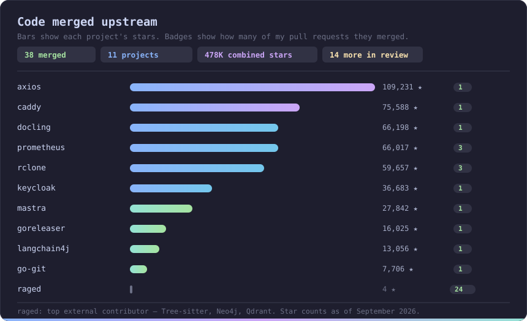
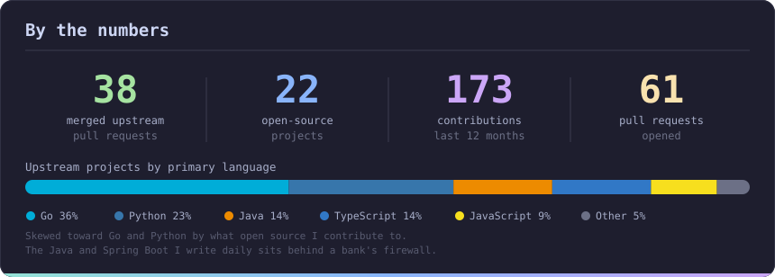

  

  
  
  
  

---

I build account-servicing and payment APIs for a global bank's core banking
platform — the kind of systems where a retry has to be idempotent, a rollback
plan matters as much as the feature, and "it works on my machine" isn't a
finish line. Day to day that means Java, Spring Boot, message-driven
integration, and a lot of time spent on failure modes.

Outside work I contribute fixes to open-source libraries I actually use, and
build backend services to keep the fundamentals sharp.

- 🔭 Building a **credit-card onboarding platform** — Spring Boot microservices, event-driven, with bureau and decisioning services split out
- 🌱 Going deeper on **distributed systems**: consistency, backpressure, and failure recovery
- 🤝 Open to backend / platform roles and to reviewing PRs on anything below

---

### Stack

  

  Also: JPA/Hibernate · Flyway · Resilience4j · Testcontainers · JUnit 5 · Prometheus · OpenAPI

---

### Open source

Fixes I've sent upstream to libraries I actually use. Each one ships with a
regression test that fails on `main` and passes with the patch.

| Project | | PR | What it fixed |
|---|---|---|---|
| [**axios**](https://github.com/axios/axios) | `109k ★` | [#11118](https://github.com/axios/axios/pull/11118) ✅ | `TypeError` when an interceptor is ejected mid-request — nullish handlers weren't guarded |
| [**caddy**](https://github.com/caddyserver/caddy) | `76k ★` | [#7922](https://github.com/caddyserver/caddy/pull/7922) ✅ | Proxy URLs resolving to a port the server would then bind |
| [**docling**](https://github.com/docling-project/docling) | `66k ★` | [#3985](https://github.com/docling-project/docling/pull/3985) ✅ | CSV dialect misdetected when a quoted field spans several lines |
| [**prometheus**](https://github.com/prometheus/prometheus) | `66k ★` | [#19324](https://github.com/prometheus/prometheus/pull/19324) [#19396](https://github.com/prometheus/prometheus/pull/19396) [#19486](https://github.com/prometheus/prometheus/pull/19486) ✅ | Discovery panicked on AWS Lightsail and ECS resources with absent optional fields |
| [**rclone**](https://github.com/rclone/rclone) | `60k ★` | [#9785](https://github.com/rclone/rclone/pull/9785) [#9786](https://github.com/rclone/rclone/pull/9786) [#9801](https://github.com/rclone/rclone/pull/9801) ✅ | Truncated uploads reported as successful on box, yandex and huaweidrive |
| [**keycloak**](https://github.com/keycloak/keycloak) | `37k ★` | [#51356](https://github.com/keycloak/keycloak/pull/51356) ✅ | Blank key-attestation values emitted into OID4VCI metadata |
| [**mastra**](https://github.com/mastra-ai/mastra) | `28k ★` | [#20591](https://github.com/mastra-ai/mastra/pull/20591) ✅ | Stale `@mastra/core` peer floors across nine store packages |
| [**goreleaser**](https://github.com/goreleaser/goreleaser) | `16k ★` | [#6752](https://github.com/goreleaser/goreleaser/pull/6752) ✅ | Generated Homebrew Casks didn't pass `brew style` |
| [**langchain4j**](https://github.com/langchain4j/langchain4j) | `13k ★` | [#6091](https://github.com/langchain4j/langchain4j/pull/6091) ✅ | Splitter failed outright on text with no detectable sentence boundary |
| [**go-git**](https://github.com/go-git/go-git) | `7.7k ★` | [#2305](https://github.com/go-git/go-git/pull/2305) ✅ | Revlist path validation rejected objects it shouldn't walk |
| [**raged**](https://github.com/lexasub/raged) | | **24 merged** | Top external contributor — Tree-sitter parsing, Neo4j graph, Qdrant vectors |

✅ merged. Currently in review: <a href="https://github.com/langgenius/dify/pull/40879">dify</a> (155k ★, constant-time signature comparison),
<a href="https://github.com/spf13/cobra/pull/2473">cobra</a> (45k ★), <a href="https://github.com/thanos-io/thanos/pull/8976">thanos</a> (14k ★),
<a href="https://github.com/Unstructured-IO/unstructured/pull/4451">unstructured</a> (15k ★, ×2),
<a href="https://github.com/Chainlit/chainlit/pull/3013">chainlit</a> (12k ★), <a href="https://github.com/goccy/go-json/pull/600">go-json</a> (3.7k ★),
plus follow-ups on prometheus, rclone, langchain4j, go-git, mastra and hermes-workspace.

---

### Stats

---

  

