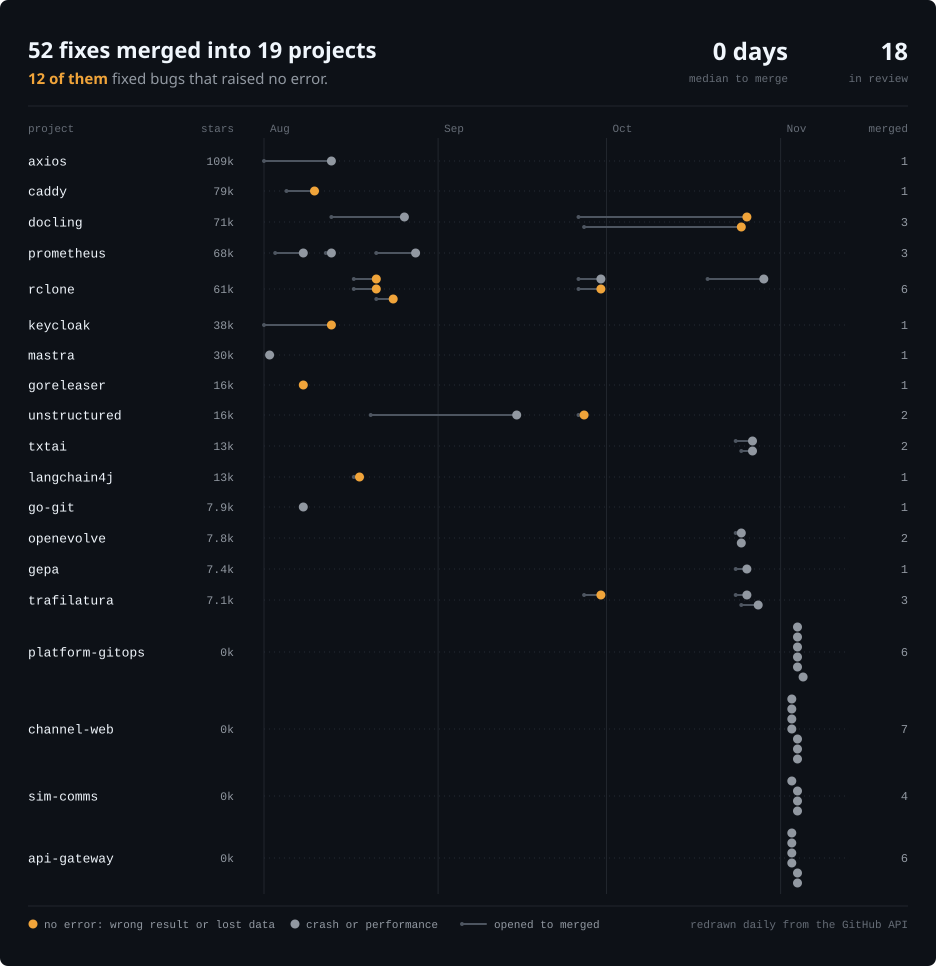

<samp>backend engineer · java · spring boot · postgres · rabbitmq · kafka · chennai</samp>

I finish things. Give me a broken service or a bug nobody has picked up: I'll find the cause, write the test that proves it, and ship the fix. Before this, 3 years of payment and account APIs at a global bank. **Open to backend roles, available now.**

<samp><a href="https://r0h1tb.github.io">site</a> · <a href="https://r0h1tb.github.io/ask/">ask my work</a> · <a href="https://www.linkedin.com/in/rohit-behera-64877b182/">linkedin</a> · <a href="mailto:rohit.behera12232@gmail.com">email</a></samp>

<table><tr><td valign="top" width="50%">

**Merged upstream**

<!-- merged starts -->
[prometheus #20536](https://github.com/prometheus/prometheus/pull/20536) drop metrics with unsupported temporality instead of rejecting the request Nov 23 
[unstructured-ingest #832](https://github.com/Unstructured-IO/unstructured-ingest/pull/832) stop generator_batching_wbytes from dropping items or yielding an empty batch Nov 19 
[gcfg #16](https://github.com/go-git/gcfg/pull/16) Read a leading BOM and continued values the way git does Nov 18 
[platform-gitops #12](https://github.com/cards-pilot-estate/platform-gitops/pull/12) the local CA moves here; Flux is cert-manager's only owner Nov 5 
[channel-web #14](https://github.com/cards-pilot-estate/channel-web/pull/14) wait for the step-up code before entering it Nov 4 
[platform-gitops #10](https://github.com/cards-pilot-estate/platform-gitops/pull/10) otp-service 7750b06 Nov 4
<!-- merged ends -->

</td><td valign="top" width="50%">

**In review**

<!-- review starts -->
[spring-ai #7445](https://github.com/spring-projects/spring-ai/pull/7445) Escape punctuation in Redis TAG filter values Nov 22 
[go-git #2645](https://github.com/go-git/go-git/pull/2645) repository, Prefer refs to abbreviated ids in ResolveRevision Nov 22 
[prometheus #20530](https://github.com/prometheus/prometheus/pull/20530) keep a staleness marker followed by a later sample in one commit Nov 21 
[rclone #10403](https://github.com/rclone/rclone/pull/10403) serve ftp: fix APPE and resumed uploads destroying the existing file Nov 21 
[spring-ai #7440](https://github.com/spring-projects/spring-ai/pull/7440) Keep parenthesized groups in Qdrant filters Nov 21 
[docling-core #923](https://github.com/docling-project/docling-core/pull/923) stop key-value graph rendering at a to_child cycle Oct 25
<!-- review ends -->

</td></tr></table>

**Building**

<!-- building starts -->
[splitlint](https://github.com/r0h1tb/splitlint) finds the Unicode bugs in RAG text splitters updated Sep 9 
[plumb](https://github.com/r0h1tb/plumb) makes AI coding agents prove a task is actually done updated Aug 16 
[r0h1tb.github.io](https://github.com/r0h1tb/r0h1tb.github.io) my site: a failure lab, retrieval with evals updated Oct 7 
[raged](https://github.com/lexasub/raged/pulls?q=is%3Apr+author%3Ar0h1tb+is%3Amerged) code search for AI agents, 25 of my PRs merged
<!-- building ends -->

<!-- totals starts -->
55 fixes merged into 21 projects · 21 in review · kept current daily by [a script](build_readme.py), not by hand
<!-- totals ends -->
